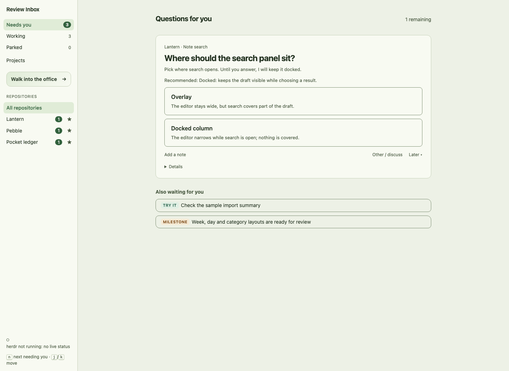
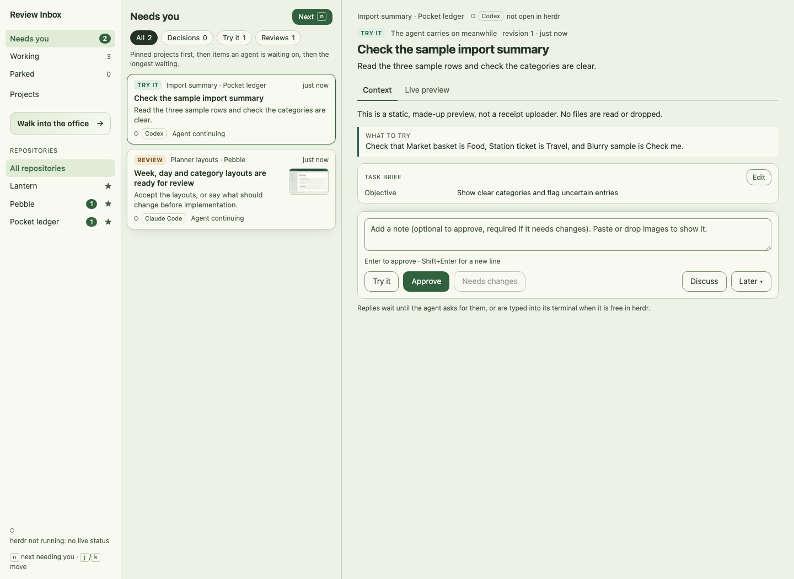

# Review Inbox

A local review queue for coding agents: decisions, things to try, and milestones in one place.
Your answer goes back to the conversation that asked; there is no reasoning agent in the middle and no model API call from the service.





These screenshots use only invented projects and purpose-made demo evidence; see [screenshot provenance](docs/screenshots/README.md).

## Trust and privacy — read before starting

Review Inbox runs with **your operating-system user's permissions**. It binds to `127.0.0.1`, but loopback is not authentication: it assumes trusted local users, processes, agents and checkouts. Session IDs route replies; they are not passwords. Browser Origins are checked when present; non-browser clients without an Origin are trusted. There is no supported remote, shared-host or reverse-proxy security guarantee. See [SECURITY.md](SECURITY.md).

- **Reads:** agent submissions and explicitly attached files; repository paths and git/worktree metadata; local usage/session files under `~/.claude/projects`, `~/.codex/sessions`, `~/.pi/agent/sessions`, and cached usage in `~/.claude.json`. Local usage reads still happen with all three optional integrations off. Changing only `INBOX_DATA_DIR` does **not** isolate these reads; use a temporary `HOME` for experiments.
- **Stores:** review text, session identities, project paths, answers and delivery records, office messages/work, agent/team metadata and usage counts in SQLite; copies of attached evidence and uploads, crew configuration and handoffs in the data directory (default `~/.review-inbox`). Activity is in memory. Treat the whole directory, including backups and logs, as private. There is no automatic retention expiry.
- **Account call, off by default:** `INBOX_CODEX_ACCOUNT_POLLING=1` reads the existing login in `~/.codex/auth.json` and sends an authenticated usage request to `https://chatgpt.com/backend-api/wham/usage`. It is not a model request. The token is not refreshed, written, logged or stored by the service; only usage readings are retained.
- **Presence discovery, off by default:** `INBOX_PRESENCE_DISCOVERY=1` polls herdr for agents and their live status. Office actions can still invoke herdr when explicitly requested; this setting controls background discovery, not a sandbox.
- **Process cleanup, off by default:** `INBOX_BROWSER_CLEANUP=1` enables machine-wide headless-browser discovery and controls. It may send SIGTERM, then SIGKILL, to browsers deemed forgotten; this is not confined to the data directory or one checkout. Leave it off unless you want that automation.
- **Full-office authority:** with herdr connected, office actions can prompt agents, open/close panes, switch harnesses, create git worktrees and finish projects. Previews load the URL supplied by the agent in your browser; open only evidence and previews you trust.

Ordinary `npm start` leaves all three opt-ins off. **`npm run restart-office` is different:** its full-office defaults enable all three. Use the explicit settings below if you use that script. A safe first look is the isolated demo, which disables all three, uses a temporary HOME/data directory and cannot connect to your herdr session.

## Requirements

- Git, npm, and **Node >=24.2.0** (built-in SQLite, erasable TypeScript and `import.meta.main`). `.nvmrc` and CI select **24.14.0** as the reproducible baseline.
- **macOS and Linux** for the core inbox. CI is configured for both; Windows is not a supported baseline. Use a current browser; the optional 3D office needs WebGL.
- The **full office is experimental and macOS-first**. It additionally needs [herdr](https://herdr.dev), its executable and session socket, and installed, logged-in harness CLIs (Pi and/or Claude Code; Codex can use the core CLI). `restart-office` needs `lsof` and `ps`. No minimum herdr release or Linux full-office compatibility is yet certified; it must support agent listing/status, guarded `agent prompt`, pane creation/focus/closing and agent start. See [architecture and compatibility](docs/ARCHITECTURE.md).
- The Pi extension targets the pinned `@earendil-works/pi-coding-agent` **0.86.0** API, not any arbitrary Pi distribution. Verify your running harness separately; an SDK typecheck is not a live-harness certification.

Distributed as an **MIT-licensed git checkout**, not an npm package (`private: true` stays set).

## Quick start: core inbox

No herdr or harness login is required for this path.

```sh
git clone https://github.com/JesperMundbjerg/review-inbox.git
cd review-inbox
npm ci
npm run build
```

For a first look without reading your existing sessions or storing demo items in your regular inbox:

```sh
npm run demo
```

Open the **Review Inbox demo URL printed in the terminal**. Choose an option for Lantern's search decision: within a few seconds the pretend agent prints the answer and acknowledges it. This is the first end-to-end round trip. The Pocket ledger preview is static HTML, not a receipt uploader. Ctrl-C stops both demo servers and deletes their temporary data. No separate `npm start` is needed for the demo.

For your own persistent inbox, after reviewing the privacy section:

```sh
npm start                       # http://localhost:4870
```

In a second terminal in this checkout, check a manual round trip without a global CLI install:

```sh
node src/cli/inbox.ts --harness codex --session onboarding-check \
  decide "Where should note search sit?" --key onboarding-search \
  --request "Choose a layout; until you answer, search stays docked." \
  --option "Overlay: covers part of the draft" \
  --option "Docked: narrows the editor but keeps the draft visible"
# Answer in the browser, then run with the SAME session identity:
node src/cli/inbox.ts --harness codex --session onboarding-check replies --ack
```

The reply is printed once received; running `replies --ack` again should say there are no replies waiting. This synthetic identity only exercises the protocol; it does not start Codex. Real agents submit through the same CLI, Pi's live extension, or Claude Code's hooks. Without a live integration, they must pull replies themselves. [Connect an agent](#connect-an-agent) below describes each route.

## Quick start: full office

First get the core round trip working. Install herdr following its own instructions, install/login to the harnesses you intend to run, and start a herdr session. From a pane in **that same session**, give the service the executable and socket paths (do not reuse a different session's socket):

```sh
export HERDR_BIN_PATH="$(command -v herdr)"
# HERDR_SOCKET_PATH is supplied by herdr; verify it is present in this pane.
: "${HERDR_SOCKET_PATH:?Start this from your agents' herdr session}"
export INBOX_PRESENCE_DISCOVERY=1
export INBOX_CODEX_ACCOUNT_POLLING=0
export INBOX_BROWSER_CLEANUP=0
npm start
```

Stop the core service first if it is using the same port. Start an agent in the session, connect its delivery integration below, then open **Walk into the office** (`/#/world`) or **Projects** (`/#/teams`). Confirm the agent appears, submit a review from it, and answer. The reply should reach the same conversation. If it does not, check the session identity, inherited `INBOX_URL`, delivery integration and herdr socket before assuming it was delivered.

herdr is **also a delivery and control path**, not just decoration: office messages and idle-session fallback replies use guarded `herdr agent prompt`. Pane/project lifecycle and harness switching depend on it. Without herdr, the core inbox's submit/answer/pull flow and configured Pi/Claude integrations still work, but those office operations do not.

## Ports and settings

| Variable | Default | Purpose |
|---|---|---|
| `INBOX_PORT` | `4870` | Loopback service port |
| `INBOX_DATA_DIR` | `~/.review-inbox` | Database, evidence, uploads and office state |
| `INBOX_URL` | `http://127.0.0.1:$INBOX_PORT` | Agent CLI/extension destination; export in each agent's environment |
| `INBOX_CODEX_ACCOUNT_POLLING` | off | Authenticated Codex usage polling |
| `INBOX_PRESENCE_DISCOVERY` | off | Background herdr discovery |
| `INBOX_BROWSER_CLEANUP` | off | Machine-wide headless-browser watcher and controls |
| `HERDR_BIN_PATH` | `herdr` | Executable for office actions |
| `HERDR_SOCKET_PATH` | `~/.config/herdr/herdr.sock` | herdr session socket |
| `DEMO_PORT`, `DEMO_PREVIEW_PORT` | `0` (free ports) | Isolated demo inbox and static preview; never `4870` |

The three opt-ins accept `1`/`true` and `0`/`false`; missing is off and invalid values fail startup. `npm run dev` runs the service plus Vite at **4871** (Vite may fall forward if occupied). Its proxy follows `INBOX_PORT`. The demo preview has **no fixed 4873 port** anymore: follow the printed URL.

For a changed service port, export **both** `INBOX_PORT` and `INBOX_URL` before launching the service and agents. Literal Claude HTTP-hook URLs must be updated too. If a port is occupied, stop only your own test process or choose another port; do not use `restart-office` as a scratch-test shortcut. If `inbox` is not on PATH, use `node /path/to/review-inbox/src/cli/inbox.ts`, or opt into `npm link`.

## Connect an agent

Use `node src/cli/inbox.ts` from the checkout, or `npm link` for the `inbox` command used below. Hooks running elsewhere need the absolute command path or a PATH containing `inbox`. The CLI infers identity from `CLAUDE_CODE_SESSION_ID`, `CODEX_THREAD_ID` or `HERDR_PANE_ID`, or accepts `--harness` and `--session`. Pi session identity is the live session file's absolute path, not its header ID. Resubmitting the same `--key` revises an item.

```sh
inbox try "Check the import summary" --preview http://localhost:3000/import \
  --check "Check the three sample categories"
inbox try "Import walkthrough" --page "Upload=http://localhost:3000/import" \
  --look "Three sample rows" --page "Review=http://localhost:3000/import/review"
inbox milestone "Planner layouts ready" --screenshot out/week.png
inbox milestone "Animation pass" --video out/intro.mp4
inbox activity "Tuning the walkthrough" --next "Import review"
inbox replies --ack
```

Use two or more options for a choice, or none for an open question; one option is refused. Say what you need and what happens while you wait. Attach only evidence safe for your local reviewers. Regular explicitly attached files are copied, not symlinks or dotfiles: images/PDF/Markdown/text up to 20 MB; MP4/WebM/MOV up to 200 MB each. Playback depends on browser codecs; nothing is transcoded. For current protocol details, see [API](docs/API.md).

### Pi: live delivery

Merge the extension path into `extensions` in `~/.pi/agent/settings.json`, preserving existing entries:

```json
{ "extensions": ["/path/to/review-inbox/integrations/pi/review-inbox.ts"] }
```

It supplies `review_submit` and `review_activity`, reports activity, and delivers replies immediately when idle or as a follow-up when busy, acknowledging once Pi takes them. `review_submit` supports `screenshots`, `videos` and live `pages`.

### Claude Code: turn-boundary delivery and optional activity

**Merge, do not replace**, existing settings and hook arrays in `~/.claude/settings.json`. This combined example keeps the Stop delivery and optional activity hooks together. Change every literal URL if your service port differs:

```json
{
  "hooks": {
    "Stop": [{ "hooks": [
      { "type": "command", "command": "inbox hook claude" },
      { "type": "http", "url": "http://127.0.0.1:4870/api/hooks/claude" }
    ] }],
    "UserPromptSubmit": [{ "hooks": [{ "type": "command", "command": "inbox hook claude" }] }],
    "SessionStart": [{ "hooks": [{ "type": "command", "command": "inbox hook claude" }] }],
    "PreToolUse": [{ "hooks": [{ "type": "http", "url": "http://127.0.0.1:4870/api/hooks/claude" }] }],
    "SubagentStart": [{ "hooks": [{ "type": "http", "url": "http://127.0.0.1:4870/api/hooks/claude" }] }],
    "SubagentStop": [{ "hooks": [{ "type": "http", "url": "http://127.0.0.1:4870/api/hooks/claude" }] }]
  }
}
```

The command hooks deliver at turn boundaries, prompt submission and session start. The HTTP hooks report current tools/helpers and do not change Claude's behavior; omit them if unwanted. An idle session connected through herdr can receive the terminal fallback. Hooks do nothing useful while the service is down; check PATH and inherited URL when troubleshooting.

### Codex: explicit pull

Submit via the CLI, then collect with `inbox replies --ack`. Do not assume Codex hooks or `codex queue` are verified live delivery paths. See the [compatibility notes](docs/ARCHITECTURE.md).

## Office reference (optional)

- **Projects** (`/#/teams`) shows projects/standing teams, members, leads, branch and status without the 3D view. A project team follows a worktree; a standing team persists across checkouts. A lead is called its **first mate**. The crew guide selects harness/model choices; do not assume a subscription or model is available just because it is configured.
- In the 3D view, click an agent or project to see activity and conversation, send an instruction, or follow its review card. Lamps show working, waiting, turn finished, idle or offline. Activity hooks add tool/helper details. Agents waiting for your review gather in the clearing; blocked teams surface their lead.
- Move with WASD/arrows, Shift to run, drag to turn, and scroll/pinch/+ or − to zoom. The office is another view of the same state, not a second task system.
- **New project** creates a sibling worktree (for example `lantern-search`, branch `worktree-search`) and starts its lead via herdr. **Finish project** refuses uncommitted work or busy agents, closes its agents and removes the worktree; it deletes a branch only once merged. Treat these as real checkout operations.
- Messages are queued until the recipient can take a prompt. **Tell all leads** broadcasts to selected project/standing-team leads; offline recipients stay queued. Paste/drop images into text boxes to attach them (PNG/JPEG/GIF/WebP up to 10 MB); uploads live in the data directory.
- The optional browser watcher finds headless/automation browsers, attributes them where possible, and closes forgotten ones only under its idle/orphan rules. It is not a general-purpose process sandbox; see [DESIGN](docs/DESIGN.md) and keep cleanup off for ordinary experiments. Agents should close their own browser in `finally` regardless.

```sh
inbox team
inbox say Agnes "Can you check the sample labels?"
inbox say founder "The layout is ready for review."
inbox handoff "Search layout" --summary "Done in src/search; check the narrow view" --to Review
inbox review WORK_ID changes --notes "The narrow view still clips the title"
inbox handoff --work WORK_ID --summary "Title wrapping fixed"
P=$(inbox pane)                 # new crew pane in the calling herdr tab
```

Handoffs go to the named team or the sender's configured downstream team. Only the receiving team can review; a changes verdict needs notes. Project adapters and the limits of the implemented orchestration are documented in [ORCHESTRATION](docs/ORCHESTRATION.md).

### Restarting a configured full office

`npm run restart-office -- --build` rebuilds and restarts this checkout's service, logging to `office.log` in the data directory. It requires `lsof`, `ps`, `HERDR_BIN_PATH` and `HERDR_SOCKET_PATH`; it never stops herdr. It stops the listener only if it identifies it as Node running `src/server/main.ts`, refusing unrelated listeners.

herdr settings come from the environment, then `office.env` (`KEY=VALUE` lines) in the data directory, then the running office's environment. **Unlike ordinary startup, the script defaults all three integrations to on.** For a privacy-conservative full office, put these explicit overrides in `office.env` or export them before the command:

```sh
INBOX_PRESENCE_DISCOVERY=1
INBOX_CODEX_ACCOUNT_POLLING=0
INBOX_BROWSER_CLEANUP=0
```

The current environment overrides `office.env`. Ordinary `npm start` does not load that file. Verify the chosen port, data directory and socket before restarting any existing office.

### Backup, update and deletion

Stop the service, then copy the **whole data directory** to a private backup before updating with git and rebuilding. Keep the stopped database and its SQLite sidecar files together with evidence/uploads and configuration. See [CHANGELOG](CHANGELOG.md) for compatibility notes; do not assume a downgrade can read a migrated database.

To erase an installation's retained state, stop it and delete its chosen data directory and any backups. This does not delete the harnesses' original sessions or credentials, git worktrees, or previously opened previews. Remove hooks/extensions and unlink the CLI separately if uninstalling. Never post a database or handoff directory as a public bug attachment.

## Contributing and release caveat

See [CONTRIBUTING](CONTRIBUTING.md), [CODE_OF_CONDUCT](CODE_OF_CONDUCT.md), [AGENTS](AGENTS.md), [DESIGN](docs/DESIGN.md), [ARCHITECTURE](docs/ARCHITECTURE.md) and [API](docs/API.md). License: [MIT](LICENSE).

**Release caveat:** the pinned Pi SDK brings a **dev-only transitive `brace-expansion` advisory**. It is not a production service dependency; that does not mean contributor installs are risk-free. The clean checks do not resolve this advisory. Review `npm audit` before release and fix through a compatible SDK update rather than blindly applying `npm audit fix --force`.
